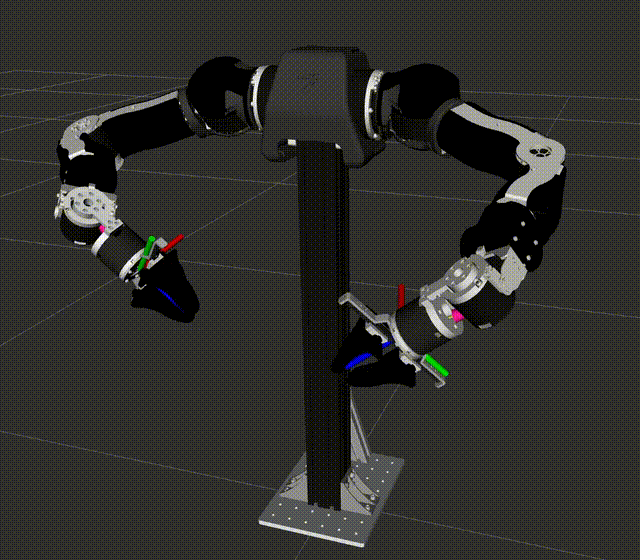

# Motion Control Simulation of Robotic arms

## Installation

This is a ROS 2 Humble package.
> First download and install the robot_description of your robotic arm. For example Franka *fr3* [here](https://github.com/frankarobotics/franka_description)!!!

```bash
cd ~/ros2_ws/src && git clone https://github.com/wei-hsuan-cheng/motion_control.git
cd ~/ros2_ws && rosdep update && rosdep install --from-paths src --ignore-src -r -y
colcon build --symlink-install --packages-select motion_control && . install/setup.bash
```

## Run Demo

- Task space motion
    ```bash
    # Simulate robot motion control (first-order dynamics in each joint velocity)
    ros2 launch motion_control task_space_motion_control.launch.py
    ```

<!-- - Robot visualization in RViz2
    <p align="center">
        
    </p> -->

## Acknowledgements

- **Robot Math Utils**: Some utilities from [Robot Math Utils](https://github.com/wei-hsuan-cheng/robot_math_utils) are used.

## Contact

- **Author**: Wei-Hsuan Cheng [(johnathancheng0125@gmail.com)](mailto:johnathancheng0125@gmail.com)
- **Homepage**: [wei-hsuan-cheng](https://wei-hsuan-cheng.github.io)
- **GitHub**: [wei-hsuan-cheng](https://github.com/wei-hsuan-cheng)